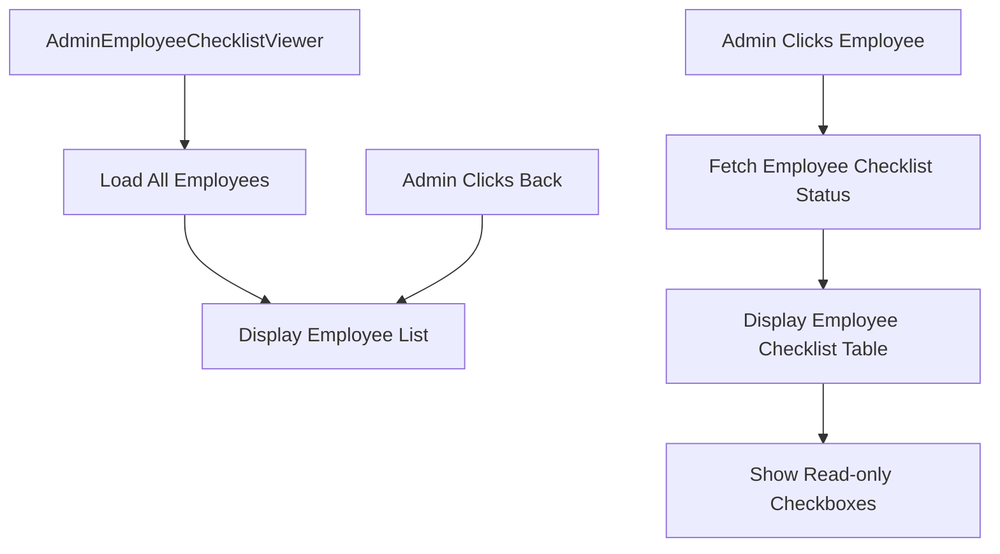

# Design Document

## Overview

The Admin Employee Checklist Viewer provides administrators with a two-view interface: first, a list of all employees, and second, a detailed read-only view of an individual employee's checklist completion status. This allows admins to monitor and verify employee task completion.

## Architecture

### Component Structure

```
AdminEmployeeChecklistViewer (new page)
├── Employee List View
│   ├── Page Header
│   ├── Employee Cards/List
│   └── Loading/Empty States
└── Employee Checklist Detail View
    ├── Back Button
    ├── Employee Info Header
    ├── Table Container (scrollable)
    │   ├── Fixed Column (checklist items)
    │   └── Scrollable Columns (date columns)
    │       └── Read-only Checkbox Cells
    └── Loading/Empty States
```

### Data Flow



### Routing Changes

Add new route for admin employee checklist viewer:
- Path: `/admin/employee-checklist`
- Component: `AdminEmployeeChecklistViewer`
- Protected: Admin role only

Update LayoutShell sidebar to include new navigation link for admins.

## Components and Interfaces

### AdminEmployeeChecklistViewer Component

**Location:** `client/src/pages/AdminEmployeeChecklistViewer.jsx`

**State Management:**
```javascript
{
  employees: [],             // Array of all employees
  selectedEmployee: null,    // Currently selected employee object
  checklistStatus: {},       // Map: { date: { itemId: boolean } }
  dateColumns: [],           // Array of date strings (sorted)
  isLoadingEmployees: boolean,
  isLoadingChecklist: boolean,
  view: 'list' | 'detail'    // Current view state
}
```

**Views:**

1. **Employee List View:**
   - Grid or list of employee cards
   - Each card shows: name, role, status
   - Click handler to select employee

2. **Employee Checklist Detail View:**
   - Back button to return to list
   - Employee name and info header
   - Read-only checklist table (same structure as employee view)
   - Checkboxes disabled/read-only

### Data Structure

**Employee Object:**
```javascript
{
  _id: "employeeId",
  name: "Employee Name",
  roleTitle: "Developer",
  status: "Active",
  email: "employee@example.com"
}
```

**Checklist Status (same as employee view):**
```javascript
{
  _id: "statusId",
  employee: "employeeId",
  date: "2024-01-15",
  checklist: {
    "1": true,
    "2": false,
    "3": true
  }
}
```

### API Endpoints

**Existing Endpoints to Use:**
- `GET /employees` - Fetch all employees (admin only)
- `GET /employees/checklist-status` - Fetch checklist status (needs modification)

**New Endpoint Needed:**
- `GET /employees/:employeeId/checklist-status` - Fetch checklist status for specific employee (admin only)

### LayoutShell Sidebar Update

Add new navigation link for admins:
```javascript
{
  href: '/admin/employee-checklist',
  label: 'Employee Checklist',
  roles: ['admin']
}
```

## Styling and Visual Design

### Employee List View

**Layout:**
- Grid layout: 3 columns on desktop, 2 on tablet, 1 on mobile
- Card design with hover effects
- Employee avatar or initials
- Name, role, and status badge

**Card Design:**
- White background with shadow
- Rounded corners (12px)
- Padding: 24px
- Hover: elevated shadow, scale slightly
- Cursor: pointer

### Employee Checklist Detail View

**Layout:**
- Back button at top left
- Employee info header with name and role
- Table structure identical to employee checklist view
- Fixed left column: 400px width
- Date columns: 120px width each
- Horizontal scroll

**Table Design:**
- Same styling as EmployeeChecklist component
- Checkboxes: disabled attribute, pointer-events: none
- Visual indicator that checkboxes are read-only (lighter color, no hover effect)

### Color Scheme
- Same as existing application
- Read-only checkboxes: gray-400 (lighter than editable)
- Selected employee card: sky-100 background

### Responsive Design
- Employee list: responsive grid
- Checklist table: horizontal scroll on all devices
- Back button: always visible and accessible

## Error Handling

### Scenarios

1. **Failed to load employees**
   - Display error message
   - Provide retry button
   - Log error to console

2. **Failed to load employee checklist**
   - Display error message
   - Provide back button to return to list
   - Show empty state

3. **No employees found**
   - Display friendly empty state
   - Suggest adding employees
   - Show illustration or icon

4. **Employee has no checklist data**
   - Display message: "This employee hasn't filled out any checklists yet"
   - Show empty table or message
   - Provide back button

## User Interactions

### Selecting an Employee

1. Admin views employee list
2. Admin clicks on employee card
3. System fetches employee's checklist status
4. View transitions to checklist detail
5. Table displays with read-only checkboxes

### Viewing Checklist

1. Admin sees employee name at top
2. Admin scrolls horizontally to view different dates
3. Admin sees checked/unchecked status for each item
4. Checkboxes are not clickable (read-only)

### Returning to List

1. Admin clicks "Back to Employee List" button
2. View transitions back to employee list
3. Previous selection is cleared

### Keyboard Navigation

- Tab: Navigate between employee cards
- Enter: Select employee
- Escape: Return to employee list (when in detail view)

## Performance Considerations

### Optimization Strategies

1. **Lazy Loading**
   - Load employee list first
   - Load checklist data only when employee is selected

2. **Caching**
   - Cache employee list with React Query
   - Cache individual employee checklist data
   - Invalidate cache appropriately

3. **Pagination**
   - Consider pagination if employee list is very large (>100 employees)
   - Implement search/filter for large lists

## Testing Strategy

### Manual Testing Checklist
- [ ] Sidebar link appears for admins only
- [ ] Employee list loads correctly
- [ ] Employee cards are clickable
- [ ] Clicking employee loads their checklist
- [ ] Checklist displays with correct data
- [ ] Checkboxes are read-only (not clickable)
- [ ] Back button returns to employee list
- [ ] Horizontal scroll works in checklist view
- [ ] Fixed checklist column stays in place
- [ ] Empty states display correctly
- [ ] Error handling works properly
- [ ] Responsive design works on mobile

## Implementation Notes

### Technology Stack
- React with hooks (useState, useEffect, useCallback)
- React Query for data fetching and caching
- Tailwind CSS for styling
- React Router for navigation
- Same CHECKLIST_ITEMS array as EmployeeChecklist component

### Code Reusability
- Consider extracting checklist table into a shared component
- Reuse CHECKLIST_ITEMS constant from EmployeeChecklist
- Share styling classes between employee and admin views

### Accessibility
- ARIA labels for employee cards
- Keyboard navigation support
- Focus management when switching views
- Screen reader announcements for view changes
- Disabled checkboxes properly marked with aria-disabled

### Security
- Ensure admin-only access via RoleGuard
- Validate admin role on backend endpoints
- Prevent employees from accessing other employees' data
- Log admin access to employee checklists (optional audit trail)
