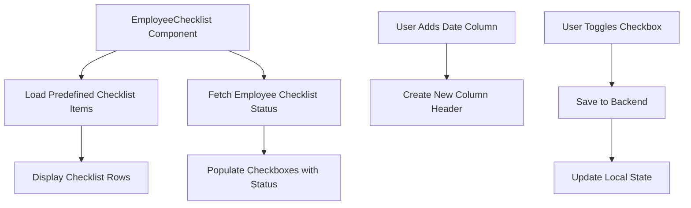

# Design Document

## Overview

The Employee Checklist feature provides a table-based interface for employees to track daily task completion. The design uses predefined checklist items as rows and dates as dynamically added columns, with checkboxes at each intersection to mark completion status.

## Architecture

### Component Structure

```
EmployeeChecklist (new page)
├── Page Header (title and add date button)
├── Table Container (scrollable)
│   ├── Fixed Column (checklist items with numbers)
│   └── Scrollable Columns (date columns)
│       └── Checkbox Cells (completion status)
└── Loading/Empty States
```

### Data Flow



### Routing Changes

Add new route for employee checklist:
- Path: `/employee/checklist`
- Component: `EmployeeChecklist`
- Protected: Employee and Applicant roles only

Update LayoutShell sidebar to include new navigation link for employees.

## Components and Interfaces

### EmployeeChecklist Component

**Location:** `client/src/pages/EmployeeChecklist.jsx`

**State Management:**
```javascript
{
  checklistItems: [],        // Array of predefined checklist items
  dateColumns: [],           // Array of date strings (sorted)
  checklistStatus: {},       // Map: { date: { itemId: boolean } }
  isLoading: boolean,
  isSaving: boolean
}
```

**Predefined Checklist Items:**
```javascript
const CHECKLIST_ITEMS = [
  { id: 1, text: "Attended morning session" },
  { id: 2, text: "Came on time" },
  { id: 3, text: "Worked on my project" },
  { id: 4, text: "Asked senior team for new Project" },
  { id: 5, text: "Got code corrected" },
  { id: 6, text: "Updated client" },
  { id: 7, text: "Worked on training task" },
  { id: 8, text: "Updated Senior Team" },
  { id: 9, text: "Updated Daily Progress" },
  { id: 10, text: "Plan Next day's task" },
  { id: 11, text: "Completed all task for the day" },
  { id: 12, text: "Worked on more than 1 project (if assigned)" },
  { id: 13, text: "Tasks for the day" },
  { id: 14, text: "Did you inform you are not able to do the project ?" },
  { id: 15, text: "Did you made sure project was given to someone else ?" },
  { id: 16, text: "Did you made sure project was on time ?" },
  { id: 17, text: "Did you inform before bunking the day before ?" },
  { id: 18, text: "Did you inform before coming late ?" },
  { id: 19, text: "Did you inform when you left the meeting ?" },
  { id: 20, text: "Is freelancer needed for this project ?" },
  { id: 21, text: "Did you made sure freelancer was hired ?" },
  { id: 22, text: "Did you made sure you have been added to client's WhatsApp" },
  { id: 23, text: "Has the slack group made for this project ?" },
  { id: 24, text: "Check if it has been assigned to somebody else already ?" },
  { id: 25, text: "Choose your own supervisor" },
  { id: 26, text: "Check if the project assigned is still on and in priority" },
  { id: 27, text: "Have you taken follow up from the client?" },
  { id: 28, text: "Have you made all the tasks for the project?" },
  { id: 29, text: "Did you assign deadlines for each task?" },
  { id: 30, text: "Did you record all the relavent loom videos" },
  { id: 31, text: "Did you record organize loom videos" },
  { id: 32, text: "Was deadline followed?" },
  { id: 33, text: "Were you screensharing and working at all times?" },
  { id: 34, text: "No. of hours attended today" }
];
```

### Data Structure

**Checklist Status Entry:**
```javascript
{
  _id: "statusId",
  employee: "employeeId",
  date: "2024-01-15",
  checklist: {
    1: true,    // item 1 checked
    2: false,   // item 2 unchecked
    3: true,    // item 3 checked
    // ... other items
  },
  createdAt: timestamp,
  updatedAt: timestamp
}
```

### Database Model

**New Model: ChecklistStatus**

**Location:** `server/src/models/ChecklistStatus.js`

```javascript
{
  employee: ObjectId (ref: Employee, required),
  date: Date (required, indexed),
  checklist: Map (key: String, value: Boolean),
  createdAt: Date,
  updatedAt: Date
}
```

**Indexes:**
- Compound index on (employee, date) for fast lookups
- Unique constraint on (employee, date) combination

### API Endpoints

**New Endpoints:**
- `GET /employees/checklist-status` - Fetch all checklist status for logged-in employee
- `POST /employees/checklist-status` - Create or update checklist status for a specific date
- `PUT /employees/checklist-status/:date` - Update specific checklist status

**Request/Response Format:**

POST/PUT Request:
```javascript
{
  date: "2024-01-15",
  checklist: {
    "1": true,
    "2": false,
    "3": true
  }
}
```

GET Response:
```javascript
{
  checklistStatuses: [
    {
      _id: "statusId",
      employee: "employeeId",
      date: "2024-01-15",
      checklist: { "1": true, "2": false, ... },
      createdAt: timestamp,
      updatedAt: timestamp
    }
  ]
}
```

### LayoutShell Sidebar Update

Add new navigation link for employees:
```javascript
{
  href: '/employee/checklist',
  label: 'Checklist',
  roles: ['employee', 'applicant']
}
```

## Styling and Visual Design

### Table Layout

**Structure:**
- Fixed left column: 400px width (checklist items with numbers)
- Date columns: 120px width each (narrower than daily update chart)
- Row height: 50px
- Horizontal scroll for date columns
- Sticky header row

**Cell Design:**
- Border: 1px solid gray-300
- Padding: 8px
- Background: white
- Checkbox: centered in cell
- Hover: gray-100 background

### Color Scheme
- Header background: gray-100
- Cell borders: gray-300
- Checked checkbox: sky-500
- Unchecked checkbox: gray-300
- Row hover: gray-50
- Text: gray-900 (primary), gray-600 (secondary)

### Responsive Design
- Desktop (> 1024px): Full table with horizontal scroll
- Tablet (768px - 1024px): Reduced column widths
- Mobile (< 768px): Horizontal scroll with smaller columns

## Error Handling

### Scenarios

1. **Failed to load checklist status**
   - Display error message
   - Provide retry button
   - Show empty checkboxes as default

2. **Failed to save checkbox state**
   - Show error toast notification
   - Revert checkbox to previous state
   - Allow user to retry

3. **Network timeout**
   - Implement auto-retry with exponential backoff
   - Show saving indicator
   - Queue checkbox changes for retry

4. **Duplicate date column**
   - Prevent adding duplicate dates
   - Show warning message
   - Focus existing date column

## User Interactions

### Adding a Date Column

1. User clicks "Add Date Column" button
2. Date picker modal appears
3. User selects date
4. System validates date is not duplicate
5. New column appears in chronological order
6. Table scrolls to show new column

### Toggling a Checkbox

1. User clicks on a checkbox
2. Checkbox toggles immediately (optimistic update)
3. API call saves state to backend
4. Success: state persists
5. Error: checkbox reverts, error message shown

### Keyboard Navigation

- Tab: Move to next checkbox (right)
- Shift+Tab: Move to previous checkbox (left)
- Space: Toggle checkbox
- Arrow keys: Navigate between checkboxes

## Performance Considerations

### Optimization Strategies

1. **Debounced Saving**
   - Debounce checkbox toggles by 500ms
   - Batch multiple changes if possible

2. **Optimistic Updates**
   - Update UI immediately
   - Revert on error

3. **Caching**
   - Cache checklist status with React Query
   - Invalidate cache on updates

4. **Virtualization**
   - Consider virtualization for 35+ rows if performance issues arise

## Testing Strategy

### Manual Testing Checklist
- [ ] Sidebar link appears for employees
- [ ] All 34+ checklist items display correctly
- [ ] Add date column works
- [ ] Dates appear in chronological order
- [ ] Checkbox toggling works
- [ ] Checkbox states persist after refresh
- [ ] Horizontal scroll works smoothly
- [ ] Fixed checklist column stays in place
- [ ] Keyboard navigation works
- [ ] Error handling displays properly
- [ ] Responsive design works on mobile

## Implementation Notes

### Technology Stack
- React with hooks (useState, useEffect, useCallback)
- React Query for data fetching and caching
- Tailwind CSS for styling
- Date-fns for date formatting
- Mongoose for database model

### Accessibility
- ARIA labels for checkboxes
- Keyboard navigation support
- Focus management
- Screen reader announcements for checkbox state changes
- Sufficient color contrast

### Browser Compatibility
- Test horizontal scroll on all browsers
- Ensure sticky positioning works
- Verify checkbox styling consistency
- Test touch interactions on mobile devices
