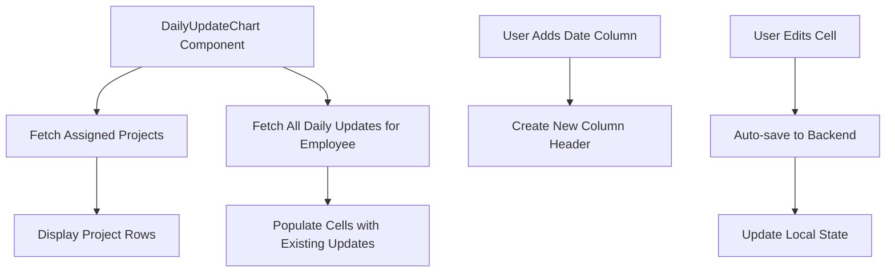

# Design Document

## Overview

The Daily Update Chart feature provides employees with a spreadsheet-like interface to track daily updates across all assigned projects. The design uses a table with projects as rows and dates as dynamically added columns, allowing employees to view and edit updates in a grid format.

## Architecture

### Component Structure

```
DailyUpdateChart (new page)
├── Page Header (title and add date button)
├── Table Container (scrollable)
│   ├── Fixed Column (project names)
│   └── Scrollable Columns (date columns)
│       └── Editable Cells (daily update entries)
└── Loading/Empty States
```

### Data Flow



### Routing Changes

Add new route for employee daily update chart:
- Path: `/employee/daily-chart`
- Component: `DailyUpdateChart`
- Protected: Employee and Applicant roles only

Update LayoutShell sidebar to include new navigation link for employees.

## Components and Interfaces

### DailyUpdateChart Component

**Location:** `client/src/pages/DailyUpdateChart.jsx`

**State Management:**
```javascript
{
  projects: [],              // Array of assigned projects
  dateColumns: [],           // Array of date strings (sorted)
  updates: {},               // Map: { projectId: { date: updateData } }
  isLoading: boolean,
  isSaving: boolean,
  editingCell: { projectId, date } | null
}
```

**Key Functions:**
- `fetchProjects()` - Get all assigned projects
- `fetchUpdates()` - Get all daily updates for the employee
- `addDateColumn(date)` - Add a new date column
- `saveUpdate(projectId, date, content)` - Save/update a daily update entry
- `getCellValue(projectId, date)` - Retrieve update text for a cell

### Data Structure

**Date Column Format:**
```javascript
{
  date: "2024-01-15",        // ISO date string
  displayLabel: "Jan 15"     // Formatted display
}
```

**Update Entry:**
```javascript
{
  _id: "updateId",
  project: "projectId",
  employee: "employeeId",
  date: "2024-01-15",
  summary: "Daily update text content",
  hoursLogged: 0,            // Optional, can be 0 for chart entries
  nextPlan: "",              // Optional for chart entries
  createdAt: timestamp,
  updatedAt: timestamp
}
```

### API Endpoints

**Existing Endpoints to Use:**
- `GET /projects?assigned=true` - Fetch assigned projects
- `GET /projects/:projectId/updates` - Fetch updates for a project
- `POST /projects/:projectId/updates` - Create new update
- `PUT /projects/:projectId/updates/:updateId` - Update existing entry

**New Endpoint Needed:**
- `GET /employee/daily-updates` - Fetch all updates for logged-in employee across all projects

### LayoutShell Sidebar Update

Add new navigation link for employees:
```javascript
{
  href: '/employee/daily-chart',
  label: 'Daily Update Chart',
  roles: ['employee', 'applicant']
}
```

## Styling and Visual Design

### Table Layout

**Structure:**
- Fixed left column: 250px width (project names)
- Date columns: 200px width each
- Row height: 80px minimum
- Horizontal scroll for date columns
- Sticky header row

**Cell Design:**
- Border: 1px solid gray-300
- Padding: 12px
- Background: white (editable), gray-50 (read-only)
- Hover: gray-100 background
- Focus: sky-500 border (2px)

### Color Scheme
- Header background: gray-100
- Cell borders: gray-300
- Active cell: sky-50 background with sky-500 border
- Hover state: gray-100
- Text: gray-900 (primary), gray-600 (secondary)

### Responsive Design
- Desktop (> 1024px): Full table with horizontal scroll
- Tablet (768px - 1024px): Reduced column widths
- Mobile (< 768px): Stack view or horizontal scroll with smaller columns

## Data Models

### DailyUpdate Model (Existing)

The existing DailyUpdate model will be used with some fields optional for chart entries:
- `summary` - Required (contains the update text)
- `nextPlan` - Optional (can be empty string for chart entries)
- `hoursLogged` - Optional (can be 0 for chart entries)
- `date` - Required (the date column)
- `project` - Required
- `employee` - Required

## Error Handling

### Scenarios

1. **Failed to load projects**
   - Display error message
   - Provide retry button
   - Log error to console

2. **Failed to save update**
   - Show error toast notification
   - Revert cell to previous value
   - Allow user to retry

3. **Network timeout**
   - Implement auto-retry with exponential backoff
   - Show saving indicator
   - Queue updates for retry

4. **Duplicate date column**
   - Prevent adding duplicate dates
   - Show warning message
   - Focus existing date column

5. **No projects assigned**
   - Display friendly empty state
   - Suggest contacting admin
   - Show illustration or icon

## User Interactions

### Adding a Date Column

1. User clicks "Add Date Column" button
2. Date picker modal appears
3. User selects date
4. System validates date is not duplicate
5. New column appears in chronological order
6. Table scrolls to show new column

### Editing a Cell

1. User clicks on a cell
2. Cell becomes editable (textarea or input)
3. User types update text
4. Auto-save triggers on blur or after 2 seconds of inactivity
5. Saving indicator appears
6. Success feedback (checkmark or green border briefly)

### Keyboard Navigation

- Tab: Move to next cell (right)
- Shift+Tab: Move to previous cell (left)
- Enter: Start editing cell
- Escape: Cancel editing, revert changes
- Arrow keys: Navigate between cells when not editing

## Performance Considerations

### Optimization Strategies

1. **Virtualization**
   - Use react-window or similar for large datasets
   - Render only visible rows and columns

2. **Debounced Saving**
   - Debounce auto-save by 2 seconds
   - Batch multiple edits if possible

3. **Lazy Loading**
   - Load updates on-demand per project
   - Implement pagination for many date columns

4. **Caching**
   - Cache project list
   - Cache updates with React Query
   - Invalidate cache on updates

## Testing Strategy

### Unit Tests
- Date column sorting logic
- Cell value retrieval from updates map
- Update save/edit functionality
- Date validation and duplicate prevention

### Integration Tests
- Complete flow: load projects → add date → edit cell → save
- API integration for fetching and saving updates
- Navigation from sidebar to daily chart page

### Manual Testing Checklist
- [ ] Sidebar link appears for employees
- [ ] Projects load correctly
- [ ] Add date column works
- [ ] Dates appear in chronological order
- [ ] Cell editing and saving works
- [ ] Existing updates display correctly
- [ ] Horizontal scroll works smoothly
- [ ] Fixed project column stays in place
- [ ] Keyboard navigation works
- [ ] Error handling displays properly
- [ ] Empty states show correctly
- [ ] Responsive design works on mobile

## Implementation Notes

### Technology Stack
- React with hooks (useState, useEffect, useCallback)
- React Query for data fetching and caching
- Tailwind CSS for styling
- Date-fns or similar for date formatting
- React Hook Form (optional, for date picker)

### Accessibility
- ARIA labels for table structure
- Keyboard navigation support
- Focus management for cell editing
- Screen reader announcements for save status
- Sufficient color contrast

### Browser Compatibility
- Test horizontal scroll on all browsers
- Ensure sticky positioning works
- Verify date picker compatibility
- Test touch interactions on mobile devices
